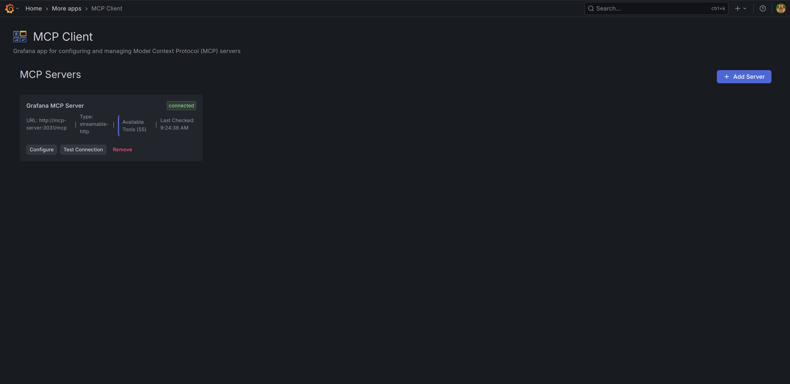

[](LICENSE)

# Grafana MCP Client App

A Grafana app plugin for configuring, managing, and integrating Model Context Protocol (MCP) servers. Enables Grafana to connect with MCP servers and expose their tools to other plugins.

## What is Model Context Protocol (MCP)?

The Model Context Protocol (MCP) is an open standard for secure connections between host applications and external data sources or tools. MCP servers provide AI systems with access to databases, APIs, and monitoring systems in a standardized way.

## Quick Start

1. Install the plugin (see [Installation](#installation))
2. Restart Grafana
3. Navigate to Apps > MCP Client
4. Configure MCP servers via provisioning (apps.yaml) or add manually
5. Browse available tools in the Tools & Capabilities page

## Features

- **Dual Configuration Modes**: Provisioning-based YAML and file-based .ini configurations
  - **Provisioning (YAML)**: Enterprise-ready configuration through Grafana's apps.yaml system
  - **File-Based (.ini)**: Grafana-style configuration file with automatic loading and reload APIs
  - **Environment Variables**: `${VAR_NAME}` expansion for secure credentials
- **Real-time Server Management**:
  - Monitor connection status and health across all configured servers
  - Automatic tool discovery and cataloging
  - Per-server tool counts and availability tracking
  - Connection testing and validation
- **Advanced Server Operations**:
  - Add, edit, and remove server configurations via UI
  - Test connections before saving
  - Import/Export server configurations
  - Server enable/disable toggle
- **Production-Grade Architecture**:
  - Go backend with REST API for server management and tool discovery
  - Frontend React application with real-time status updates
  - Comprehensive error handling and logging
  - Input validation and security protections
- **GitOps & DevOps Ready**:
  - Version-controlled configuration files
  - Container-friendly deployment patterns
  - Configuration reload without restart
- **AI Chat Integration**:
  - Integration with AI Chat Assistant plugin
  - Automatic tool exposure to LLM for intelligent tool calling
  - Real-time tool availability updates

## Screenshots



## Installation

### Prerequisites

- **Grafana >= 10.4.0** with admin privileges
- **MCP Servers**: One or more running MCP servers to connect to
- **Optional**: AI Chat Assistant plugin for enhanced AI capabilities
- **Go >= 1.24.1** (if building from source)
- **Node.js >= 18** (if building from source)

### grafana-cli (Coming Soon)

Installation via grafana-cli will be available once published to the Grafana plugin catalog.

```bash
# Coming soon:
# grafana-cli plugins install grafana-mcpclient-app
```

### Manual Installation

1. Download the latest release from GitHub
2. Extract to your Grafana plugins directory (`/var/lib/grafana/plugins/`)
3. Restart Grafana
4. Configure provisioning files as described in [Configuration](#configuration)

### Docker/Kubernetes

```yaml
# docker-compose.yml or podman-compose.yml
services:
  grafana:
    image: grafana/grafana:latest
    environment:
      - GF_PLUGINS_ALLOW_LOADING_UNSIGNED_PLUGINS=grafana-mcpclient-app
      - MCP_SERVER_URL=${MCP_SERVER_URL}
      - MCP_API_TOKEN=${MCP_API_TOKEN}
    volumes:
      - ./grafana/provisioning:/etc/grafana/provisioning:Z
      - ./grafana/plugins:/var/lib/grafana/plugins:Z
```

### Development Setup

```bash
# Clone the repository
git clone <repository-url>
cd grafana-mcpclient-app

# Install dependencies
npm install

# Build the plugin (both frontend and backend)
./scripts/build.sh
```

## Configuration

MCP servers are configured through Grafana's app provisioning system. Create or update your `grafana/provisioning/plugins/apps.yaml` file:

```yaml
apiVersion: 1

apps:
  - type: 'grafana-mcpclient-app'
    org_id: 1
    org_name: 'grafana'
    disabled: false
    jsonData:
      mcpServers:
        - id: local-grafana-mcp
          name: Local Grafana MCP Server
          url: http://grafana-mcp-server:8000/mcp
          type: local
          enabled: true
          description: Local MCP server for development and testing
          authType: none

        - id: production-mcp
          name: Production MCP Server
          url: ${MCP_SERVER_URL}
          type: remote
          enabled: true
          description: Production MCP server with authentication
          authType: bearer

    secureJsonData:
      mcpToken_production-mcp: ${MCP_API_TOKEN}
```

### Environment Variable Support

Both provisioning and .ini configuration support environment variable expansion using `${VAR_NAME}` syntax.

### Alternative: File-Based .ini Configuration

For version-controlled deployments:

```ini
# /etc/grafana/mcp-servers.ini

[local-grafana-mcp]
name=Local Grafana MCP Server
url=http://grafana-mcp-server:8000/mcp
type=local
enabled=true
auth_type=none

[production-mcp]
name=Production MCP Server
url=${MCP_SERVER_URL}
type=remote
enabled=true
auth_type=bearer
auth_token=${MCP_API_TOKEN}
```

Mount in container deployment:

```yaml
volumes:
  - ./grafana/config/mcp-servers.ini:/etc/grafana/mcp-servers.ini:Z
```

Use `/config/reload` API endpoint to reload configuration without restart.

## Architecture

### Frontend Components
- **TypeScript/React**: Modern web interface using Grafana UI components
- **Server Management**: UI for viewing and managing MCP server configurations
- **Tool Browser**: Interface for exploring available MCP tools and capabilities
- **Status Dashboard**: Real-time monitoring of server health

### Backend Services (Go)
- **REST API**: Resource handler with 10+ endpoints
  - `/servers` - List and manage server configurations
  - `/status` - Get server connection status and health
  - `/tools` - Retrieve all available tools across servers
  - `/config/reload` - Reload .ini configuration without restart
  - `/ping` - Service health check
- **MCP Client Implementation**:
  - JSON-RPC protocol communication
  - HTTP transport for MCP server connections
  - Connection pooling and status caching
- **Configuration Management**:
  - Provisioning loader for apps.yaml
  - .ini file parser with environment variable expansion

### Integration Points
- **Grafana Provisioning**: Native integration with Grafana's configuration system
- **Plugin API**: RESTful API for frontend and external plugin communication
- **MCP Protocol**: Standards-compliant Model Context Protocol implementation

## Troubleshooting

### Common Issues

**Server connection failures**
- Verify MCP server is running and accessible at the configured URL
- Check network connectivity and firewall settings
- Ensure authentication credentials are correct
- Review Grafana logs for detailed error messages

**Tools not appearing**
- Confirm MCP server is properly exposing tools via the protocol
- Check server capabilities and tool list responses
- Restart Grafana after provisioning configuration changes

**Configuration not loading**
- **For Provisioning (YAML)**:
  - Ensure provisioning file syntax is correct (valid YAML)
  - Verify environment variables are properly set
  - Check Grafana logs during startup for provisioning errors
- **For .ini Configuration**:
  - Verify file is mounted at `/etc/grafana/mcp-servers.ini`
  - Check file syntax (valid .ini format with section headers)
  - Use `/config/status` endpoint to check configuration status
  - Use `/config/reload` endpoint to reload without restart

### Debugging Steps

1. **Check Grafana Logs**
   ```bash
   journalctl -u grafana-server -f | grep -i mcp
   ```

2. **Test MCP Server Connectivity**
   ```bash
   curl -X POST http://your-mcp-server:port \
     -H "Content-Type: application/json" \
     -d '{"jsonrpc": "2.0", "method": "ping", "id": 1}'
   ```

3. **Validate Configuration**
   ```bash
   # Check configuration status
   curl http://localhost:3000/api/plugins/grafana-mcpclient-app/resources/config/status

   # Reload configuration
   curl http://localhost:3000/api/plugins/grafana-mcpclient-app/resources/config/reload
   ```

## Development

### Building the Plugin

```bash
# Install dependencies
npm install

# Development build with watch mode
npm run dev

# Production build
npm run build

# Build Go backend for multiple platforms
./scripts/build-multiplatform.sh
```

### Testing

```bash
# Run frontend tests
npm run test

# Run linting
npm run lint

# Run E2E tests
npm run e2e
```

## Security Considerations

- **Authentication**: MCP server credentials stored securely in Grafana's provisioning system
- **Environment Variables**: Sensitive data uses environment variable expansion
- **Network Security**: MCP communications use secure protocols and authentication
- **Access Control**: Integrates with Grafana's permission and user management system
- **Audit Trail**: MCP server interactions are logged

## Production Deployment

### Configuration Management

**Choose Your Configuration Approach:**

1. **Provisioning (YAML)** - Best for Kubernetes and cloud deployments
2. **File-Based (.ini)** - Best for traditional deployments and GitOps

**Best Practices:**
- Version control configuration files
- Use environment variable expansion for secrets
- Test server connections before enabling in production
- Regular backup of MCP server configurations

### Health Check Endpoints

```bash
# Plugin availability
curl http://localhost:3000/api/plugins/grafana-mcpclient-app/resources/ping

# Server status
curl http://localhost:3000/api/plugins/grafana-mcpclient-app/resources/status

# Tool availability
curl http://localhost:3000/api/plugins/grafana-mcpclient-app/resources/tools
```

### High Availability

- Configure multiple MCP servers for redundancy
- Use load balancers for high-traffic deployments
- Implement automatic failover for critical services

## API Documentation

See [docs/API.md](docs/API.md) for backend endpoint documentation.

## Contributing

See [CONTRIBUTING.md](./CONTRIBUTING.md) for development environment setup, code standards, and submission process.

## License

This project is licensed under the [Apache 2.0 License](./LICENSE).

## Changelog

See [CHANGELOG.md](./CHANGELOG.md) for version history and release notes.
